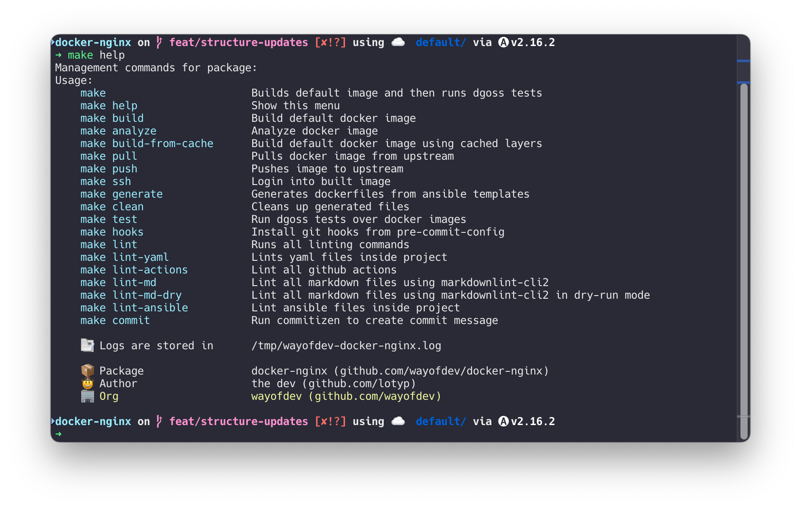

<p align="center">
    <br>
    <a href="https://wayof.dev" target="_blank">
        <picture>
            <source media="(prefers-color-scheme: dark)" srcset="https://raw.githubusercontent.com/wayofdev/.github/master/assets/logo.gh-dark-mode-only.png">
            
        </picture>
    </a>
    <br>
</p>

<div align="center">
<a href="https://actions-badge.atrox.dev/wayofdev/docker-nginx/goto"></a>
<a href="https://github.com/wayofdev/docker-nginx/tags"></a>
<a href="https://hub.docker.com/repository/docker/wayofdev/nginx"></a>
<a href="LICENSE.md"></a>
<a href="#"></a>
</div>

<br>

# Docker Image: Nginx

This image is used together with [wayofdev/docker-php-dev](https://github.com/wayofdev/docker-php-dev) and other WOD images, to create local development environment for our projects.



## ⚙️ Development

To install dependencies and start development you can check contents of our `Makefile`

### →  Requirements

For testing purposes we use **goss** and **dgoss**, follow installation instructions on [their official README](https://github.com/aelsabbahy/goss/blob/master/extras/dgoss/README.md)

<br>

### → Building locally

Generating distributable Dockerfiles from yaml source code:

```bash
make generate
```

<br>

Building default image:

```bash
git clone git@github.com:wayofdev/docker-nginx.git
cd docker-nginx
make build
```

To **build** image, **test** it and then **clean** temporary files run:

```bash
make
```

Building all images:

```bash
make build IMAGE_TEMPLATE=dev-alpine
make build IMAGE_TEMPLATE=k8s-alpine
```

<br>

## 🧪 Testing

Testing default image:

```bash
make test
```

To test all images:

```bash
make test IMAGE_TEMPLATE=dev-alpine
make test IMAGE_TEMPLATE=k8s-alpine
```

<br>

### → Code quality tools

Run **yamllint** to validate all yaml files in project:

```bash
make lint-yaml
```

Run hadolint to validate created Dockerfiles:

```bash
make lint-docker
```

Run ansible-lint to validate project files:

```bash
make lint-ansible
```

<br>

## 🔒 Security Policy

This project has a [security policy](.github/SECURITY.md).

<br>

## 🙌 Want to Contribute?

Thank you for considering contributing to the wayofdev community! We are open to all kinds of contributions. If you want to:

- 🤔 [Suggest a feature](https://github.com/wayofdev/docker-nginx/issues/new?assignees=&labels=type%3A+enhancement&projects=&template=2-feature-request.yml&title=%5BFeature%5D%3A+)
- 🐛 [Report an issue](https://github.com/wayofdev/docker-nginx/issues/new?assignees=&labels=type%3A+documentation%2Ctype%3A+maintenance&projects=&template=1-bug-report.yml&title=%5BBug%5D%3A+)
- 📖 [Improve documentation](https://github.com/wayofdev/docker-nginx/issues/new?assignees=&labels=type%3A+documentation%2Ctype%3A+maintenance&projects=&template=4-docs-bug-report.yml&title=%5BDocs%5D%3A+)
- 👨‍💻 [Contribute to the code](./.github/CONTRIBUTING.md)

You are more than welcome. Before contributing, kindly check our [contribution guidelines](.github/CONTRIBUTING.md).

[](https://conventionalcommits.org)

<br>

## 🫡 Contributors

<p align="left">
<a href="https://github.com/wayofdev/docker-nginx/graphs/contributors">

</a>
<br>
<br>
</p>

## 🌐 Social Links

- **Twitter:** Follow our organization [@wayofdev](https://twitter.com/intent/follow?screen_name=wayofdev) and the author [@wlotyp](https://twitter.com/intent/follow?screen_name=wlotyp).
- **Discord:** Join our community on [Discord](https://discord.gg/CE3TcCC5vr).

<br>

## ⚖️ License

[](./LICENSE.md)

<br>
